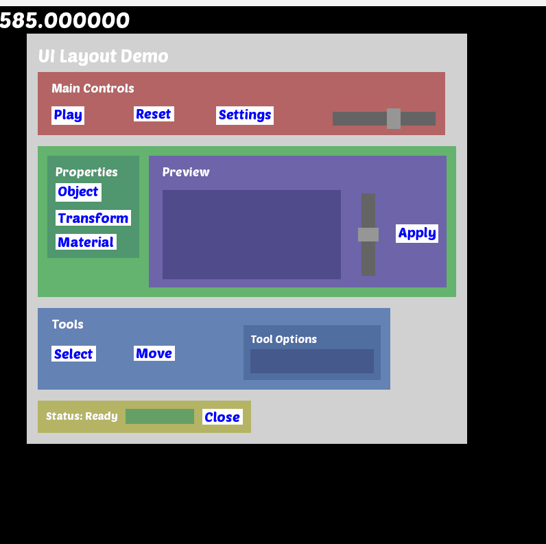

# Petal UI

A UI framework library (hopefully).
I am trying to make a library of sort where I define the UI hierarchy using json file. Then after giving the UI library some mouse data and setting up draw functions for drawing basic elements like a rectangle and text and after setting up the event callbacks for ui elements, i can run the programme and get my UI working. The library should be able to handle the rest.

As of now, i have implemented just buttons and sliders and nested groups of these elements.

